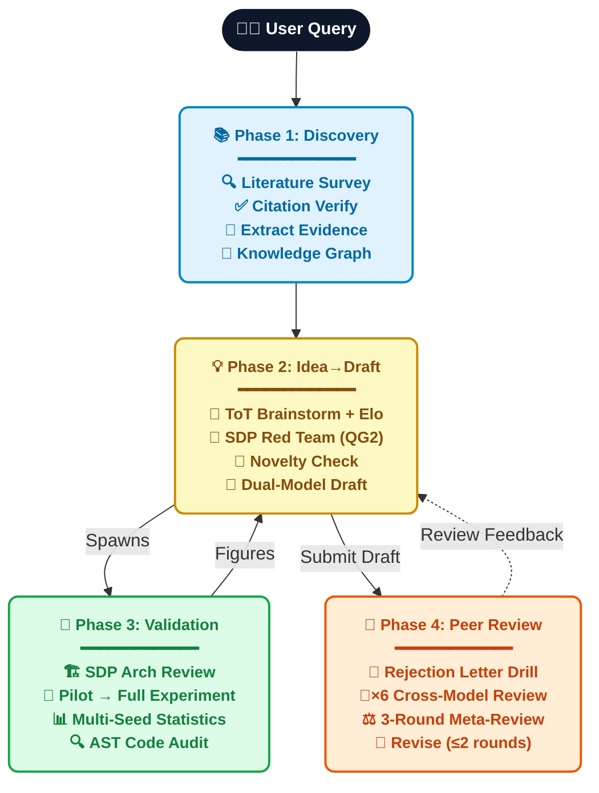
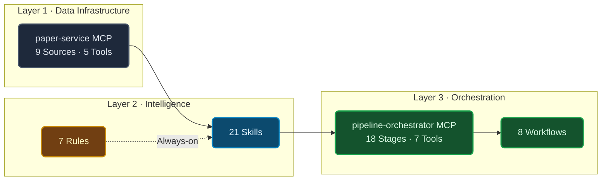
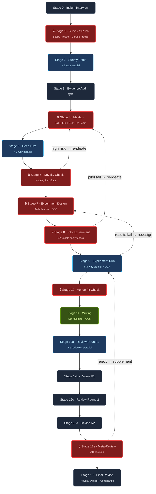

<br />
<div align="center">
  <a href="https://github.com/ChunqiGuo02/NeXus/stargazers"></a>
  <a href="https://github.com/ChunqiGuo02/NeXus/network/members"></a>
  <a href="https://x.com/Chunqi_Guo"></a>
  <a href="LICENSE"></a>

  <strong>Query → Survey → Brainstorm → Experiment → Write → Review</strong><br />
  <sub>21 Skills · 7 Rules · 8 Workflows · 2 MCP Servers · 18-Stage Pipeline</sub>
</div>

---

An **agent skill pack** that turns any LLM coding assistant (Antigravity, Claude Code, Opencode, etc.) into a full-stack academic research partner — from literature survey to top-venue paper submission.

> **Not a toy demo.** NeXus ships with 5 quality gates (QG1–QG5), 5 hard checkpoints that Autopilot cannot bypass, 12 layers of anti-mediocrity mechanisms, a deterministic 18-stage pipeline state machine with conditional rollback, experiment code auditing via AST analysis, NLP-based paper quality analysis, domain taste learning, and full `publishable` evidence traceability from data fetching to final manuscript.

---

## Table of Contents

- [What It Does](#-what-it-does)
- [Architecture Overview](#-architecture-overview)
- [Quick Start](#-quick-start)
- [Project Structure](#-project-structure)
- [MCP Server: paper-service](#-mcp-server-paper-service)
- [MCP Server: pipeline-orchestrator](#-mcp-server-pipeline-orchestrator)
- [18-Stage Pipeline](#-18-stage-pipeline)
- [Workflows](#-workflows)
- [Anti-Mediocrity: 12 Layers of Defense](#-anti-mediocrity-12-layers-of-defense)
- [Autopilot Mode](#-autopilot-mode)
- [LaTeX & Overleaf Integration](#-latex--overleaf-integration)
- [Multi-Reviewer Venue Rubrics](#-multi-reviewer-venue-rubrics)
- [Configuration](#-configuration)
- [Privacy & Security](#-privacy--security)
- [License](#-license)

---

## ✨ What It Does



---

## 🏗️ Architecture Overview

NeXus is built on three independent layers. Each layer can be used standalone, but together they form a fully orchestrated research pipeline.



| Layer | Components | Role |
|-------|-----------|------|
| **Data Infrastructure** | `paper-service` MCP | Multi-source paper search, PDF fetch, citation verification, reference graph |
| **Intelligence** | 21 Skills + 7 Rules | Domain knowledge: survey, ideation, novelty check, writing, review, experiments |
| **Orchestration** | `pipeline-orchestrator` MCP + 8 Workflows | State machine, stage routing, rollback, compliance, quality gates, handoff |

---

## 🚀 Quick Start

### 1. Clone

```bash
git clone https://github.com/ChunqiGuo02/NeXus.git
cd NeXus
```

### 2. Install MCP Servers

```bash
# Paper Service
cd mcp-servers/paper-service && pip install -e . && cd ../..

# Pipeline Orchestrator
cd mcp-servers/pipeline-orchestrator && pip install -e . && cd ../..
```

### 3. Configure Your Agent

<details>
<summary><strong>Antigravity (Gemini)</strong></summary>

Add to your MCP config (`mcp_config.json` or via settings):

```json
{
  "mcpServers": {
    "paper-service": {
      "command": "python",
      "args": ["/path/to/NeXus/mcp-servers/paper-service/server.py"]
    },
    "pipeline-orchestrator": {
      "command": "python",
      "args": ["/path/to/NeXus/mcp-servers/pipeline-orchestrator/server.py"]
    }
  }
}
```

Then open Antigravity **in the project directory**. Skills, Rules, and Workflows are auto-discovered from `.agents/`.

</details>

<details>
<summary><strong>Claude Code</strong></summary>

```bash
claude mcp add paper-service python /path/to/NeXus/mcp-servers/paper-service/server.py
claude mcp add pipeline-orchestrator python /path/to/NeXus/mcp-servers/pipeline-orchestrator/server.py
cd NeXus && claude
```

Claude Code reads `CLAUDE.md` at project root to discover capabilities.

</details>

<details>
<summary><strong>Other LLM Agents</strong></summary>

1. Copy `.agents/skills/`, `.agents/rules/`, `.agents/workflows/` to your agent's skill directory
2. Configure both MCP servers for your framework
3. The skills are plain Markdown — any agent that reads Markdown instructions can use them

</details>

### 4. Start Researching

```
# Full pipeline from scratch
User: /full-research-pipeline "graph neural networks for urban computing"

# Improve a rejected paper
User: /revise-paper (attach PDF + reviewer comments)

# Quick one-off tasks
User: Help me research urban heat island mitigation
User: Help me come up with several research ideas
User: Review this paper with the goal of NeurIPS 2026
```

---

## 📦 Project Structure

```
NeXus/
├── .agents/
│   ├── skills/                        # 21 Skills (Markdown instructions)
│   │   ├── omni-orchestrator/         # 🎯 Entry point · intent routing · domain onboarding
│   │   ├── sdp-protocol/             # 🤝 Structured Debate Protocol (cross-model collaboration)
│   │   │
│   │   │  ── Discovery ──
│   │   ├── literature-survey/         # 📚 End-to-end survey: search → fetch → extract → review
│   │   ├── citation-verifier/         # ✅ Multi-source cross-validation + retraction check
│   │   ├── claim-extractor/           # 📊 Evidence card extraction (with publishable field)
│   │   ├── evidence-auditor/          # 🔍 Evidence quality audit (QG1)
│   │   ├── pattern-promoter/          # 🧠 Auto-promote frequent claims → Knowledge Graph
│   │   ├── paper-ingestion/           # 📥 Unified paper fetch (arXiv/DOI/PDF/title → Markdown)
│   │   ├── pdf-to-markdown/           # 📄 Non-arXiv PDF parsing via marker-pdf
│   │   ├── deep-dive/                 # 📖 In-depth paper analysis + 2-hop citation expansion
│   │   │
│   │   │  ── Ideation ──
│   │   ├── idea-brainstorm/           # 💡 ToT + Elo tournament + SDP Red Team (QG2)
│   │   ├── novelty-checker/           # 🔬 4-level risk + 50-paper coverage threshold
│   │   │
│   │   │  ── Build ──
│   │   ├── experiment-runner/         # 🧪 Type A/B/C + Pilot + 3-Strike breaker + multi-seed
│   │   │
│   │   │  ── Write ──
│   │   ├── paper-writing/             # 📝 Story Skeleton + SDP debate + LaTeX pipeline
│   │   │   ├── overleaf_setup.md      #    TexLive + LaTeX Workshop + Overleaf Workshop
│   │   │   └── venue_templates.md     #    30+ conference/journal LaTeX templates
│   │   │
│   │   │  ── Review ──
│   │   ├── multi-reviewer/            # 👥 6-reviewer SDP + 3-round meta-review (QG5)
│   │   │   └── venue_rubrics/         #    12 venue-specific rubrics
│   │   │
│   │   │  ── Cross-cutting ──
│   │   ├── evolution-memory/          # 🧬 Cross-project learning distillation
│   │   ├── repo-architecture/         # 🏗️ Module boundary enforcement
│   │   ├── code-review/               # 🔎 Code review for correctness
│   │   ├── safe-refactor/             # 🔧 Safe, reviewable refactors
│   │   ├── test-author/               # 🧪 Test writing (repo-style matching)
│   │   └── verification-runner/       # ✅ Verify implementation claims
│   │
│   ├── rules/                         # 7 Rules (always-on constraints)
│   │   ├── citation-integrity.md      # All citations must be verified
│   │   ├── evidence-discipline.md     # All claims need evidence + publishable=true
│   │   ├── access-state-policy.md     # 7-level access state + Shadow isolation
│   │   ├── engineering-baseline.md    # Small diffs, follow existing conventions
│   │   ├── repo-conventions.md        # Python/pytest/ruff/mypy standards
│   │   ├── verification-policy.md     # Every change needs verification evidence
│   │   └── model-routing.md           # Multi-model stage recommendation + quota mgmt
│   │
│   └── workflows/                     # 8 Workflows (orchestration recipes)
│       ├── full-research-pipeline.md  # 18-stage lifecycle + 5 hard checkpoints
│       ├── revise-paper.md            # Rejected/draft paper upgrade (Plan A/B)
│       ├── quick-survey.md            # Rapid survey (3-5 min)
│       ├── bugfix-safe.md             # Evidence-driven bug fix loop
│       ├── hack.md                    # Fast low-ceremony implementation
│       ├── orchestrate-task.md        # Multi-agent parallel dispatch
│       ├── review-changes.md          # Code change review
│       └── verify-result.md           # Verify implementation claims
│
├── mcp-servers/
│   ├── paper-service/                 # MCP Server 1: Academic Data Infrastructure
│   │   ├── server.py                  # FastMCP entry point
│   │   ├── shared.py                  # Connection pool + retry + cache
│   │   ├── sources/                   # 9 data source integrations
│   │   │   ├── semantic_scholar.py    #   200M+ papers, all fields
│   │   │   ├── arxiv_source.py        #   CS/Physics/Math/Bio/Econ
│   │   │   ├── crossref.py            #   150M+ DOIs
│   │   │   ├── openalex.py            #   250M+ works
│   │   │   ├── unpaywall.py           #   OA link resolution
│   │   │   ├── core_api.py            #   OA repository
│   │   │   ├── europe_pmc.py          #   Biomedical literature
│   │   │   ├── datacite.py            #   Dataset DOI resolution
│   │   │   └── shadow_library.py      #   Sci-Hub/LibGen (off by default)
│   │   └── tools/                     # 5 MCP tools
│   │       ├── search_papers.py       #   Multi-source concurrent search + dedup
│   │       ├── fetch_paper.py         #   5-tier waterfall + publishable tracking
│   │       ├── verify_citation.py     #   Cross-validation + retraction check
│   │       ├── get_citations.py       #   Reference/citation graph
│   │       └── download_pdf.py        #   Secure PDF download
│   │
│   └── pipeline-orchestrator/         # MCP Server 2: Research Pipeline State Machine
│       ├── server.py                  # 7 MCP tools (advance, complete, reenter, recover, ...)
│       ├── stages.py                  # 18 pipeline stage definitions
│       ├── validators.py              # Per-stage output validators
│       ├── schemas.py                 # Pydantic v2 data contracts for all JSON files
│       ├── compliance_checker.py      # Anti-skip verification (checks filesystem, not LLM)
│       ├── quality_engine.py          # NLP-based paper quality analysis (4 analyzers)
│       ├── domain_taste_engine.py     # Learn venue standards from paper corpus
│       ├── experiment_auditor.py      # AST-based experiment code auditing
│       ├── venue_tier_registry.py     # Configurable venue tier classification
│       ├── sdp_handoff_generator.py   # Cross-model task handoff file generator
│       ├── venue_playbooks/           # Per-venue reject patterns + writing norms
│       │   └── playbooks.json         #   NeurIPS, ICLR, ICML, CVPR, ACL, AAAI
│       └── test_orchestrator.py       # 46K lines comprehensive test suite
│
├── scripts/                           # 6 Utility scripts
│   ├── cleanup_corpus.py              # Corpus dedup + quality cleanup
│   ├── extract_claims.py              # Batch claim extraction
│   ├── extract_domain_taste.py        # Domain taste profile extraction
│   ├── filter_papers.py               # Advanced paper filtering
│   ├── fetch_alphaxiv.py              # AlphaXiv paper fetcher
│   └── print_corpus.py               # Corpus pretty-printer
│
├── nexus_project.template.json        # Project configuration template
├── CLAUDE.md                          # Claude Code entry point
└── README.md
```

---

## 🔧 MCP Server: paper-service

A high-throughput academic data infrastructure with 9 data sources and intelligent fallback.

### Data Sources

| Source | Coverage | Rate Limit | Use Case |
|--------|----------|------------|----------|
| **Semantic Scholar** | 200M+ papers, all fields | 100/5min (free), 100/s (key) | Primary search + citation graph |
| **arXiv** | CS/Physics/Math/Bio/Econ | No limit | Preprint access + full text |
| **CrossRef** | 150M+ DOIs, all fields | 50/s (polite pool) | DOI resolution + metadata |
| **OpenAlex** | 250M+ works, all fields | Generous | Broad discovery + open metadata |
| **Unpaywall** | OA link resolution | Requires email | Open Access PDF discovery |
| **CORE** | OA repository | API key optional | OA full-text access |
| **Europe PMC** | Biomedical | No limit | Biomedical literature |
| **DataCite** | Dataset DOIs | Generous | Dataset citation resolution |
| **Sci-Hub / LibGen** | Shadow libraries | Off by default | Configurable, user responsibility |

### MCP Tools

| Tool | Description |
|------|-------------|
| `search_papers` | Multi-source concurrent search with automatic deduplication |
| `fetch_paper` | 5-tier waterfall: arXiv → OA → Shadow → Manual → Abstract-only. Tracks `publishable` status for evidence traceability |
| `verify_citation` | Multi-source cross-validation + retraction check via Crossref, Semantic Scholar, OpenAlex |
| `get_citations` | Bidirectional reference/citation graph via Semantic Scholar |
| `download_pdf` | Secure download with path traversal protection |

---

## 🎛️ MCP Server: pipeline-orchestrator

A deterministic state machine that drives the entire research lifecycle. The orchestrator prevents the agent from skipping steps, enforces quality gates, and manages cross-model collaboration.

### Key Capabilities

| Capability | Description |
|-----------|-------------|
| **18-Stage State Machine** | Deterministic routing with conditional rollback to any previous stage |
| **Compliance Checker** | Verifies LLM actually executed critical steps by checking filesystem artifacts — not self-reporting |
| **Quality Engine** | 4 NLP analyzers for paper content: Insight Density, Motivation Guard, Story Arc Depth, Contribution-Evidence Cross-Validation |
| **Domain Taste Engine** | Learns venue-specific writing standards from 4-tier paper corpus comparisons |
| **Experiment Auditor** | 3 AST-based detectors: Data Leakage, Seed Fix Verification, Metric Consistency |
| **Venue Tier Registry** | Configurable venue classification across 6 fields (AI/ML, CV, NLP, Robotics, Data Mining, Journals) |
| **Venue Playbooks** | Per-venue reject patterns, reviewer pet peeves, and writing norms (NeurIPS, ICLR, ICML, CVPR, ACL, AAAI) |
| **SDP Handoff Generator** | Generates self-contained cross-model task files for Review, Red Team, Arch Review, and Polishing |
| **Pydantic Data Contracts** | Type-safe schemas for all cross-skill JSON files (Evidence Graph, Hypothesis Board, Project State, etc.) |
| **Breakpoint Recovery** | Auto-detect completed stages and resume from interruption |
| **Decision Logging** | Persists user decisions at hard checkpoints for cross-session context |

### MCP Tools

| Tool | Description |
|------|-------------|
| `advance_pipeline` | Get precise instructions for the current stage (skill, outputs, rollback, parallel dispatch) |
| `complete_stage` | Validate outputs + compliance → advance / rollback / skip |
| `reenter_pipeline` | Re-enter from any stage with reviewer feedback (post-rejection) |
| `recover_pipeline` | Auto-scan outputs to recover from interrupted sessions |
| `log_decision` | Record user decisions at hard checkpoints |
| `get_pipeline_status` | Full pipeline status overview |
| `check_stage_compliance` | Pre-check compliance before completing a stage |
| `generate_sdp_handoff_file` | Generate cross-model handoff for SDP tasks |

---

## 🔄 18-Stage Pipeline

The full research pipeline is an 18-stage state machine with 5 hard checkpoints (🔒) that Autopilot can never bypass, and conditional rollback arrows for stages that may need rework.



<details>
<summary><strong>Stage Details</strong></summary>

| Stage | Name | Skill | Key Gate | Parallel | Rollback Target |
|-------|------|-------|----------|----------|-----------------|
| 0 | Insight Interview | omni-orchestrator | — | — | — |
| 1 | Survey Search | literature-survey | 🔒 Scope + Corpus Freeze | — | — |
| 2 | Survey Fetch | literature-survey | — | ⚡ 5 papers | — |
| 3 | Evidence Audit | evidence-auditor | QG1 | — | — |
| 4 | Ideation | idea-brainstorm | 🔒 Idea Approval | SDP | — |
| 5 | Deep Dive | deep-dive | — | ⚡ 3 papers | — |
| 6 | Novelty Check | novelty-checker | 🔒 Novelty Risk Gate | — | → Ideation |
| 7 | Experiment Design | experiment-runner | 🔒 Arch + QG3 | SDP | — |
| 8 | Pilot Experiment | experiment-runner | 🔒 Pilot Gate | — | → Ideation |
| 9 | Experiment Run | experiment-runner | QG4 | ⚡ 3 modules | → Exp Design |
| 10 | Venue Fit Check | omni-orchestrator | 🔒 Venue Fit | — | — |
| 11 | Writing | paper-writing | QG5 | SDP | — |
| 12a | Review Round 1 | multi-reviewer | — | ⚡ 6 reviewers | — |
| 12b | Revise Round 1 | paper-writing | — | — | — |
| 12c | Review Round 2 | multi-reviewer | — | SDP | — |
| 12d | Revise Round 2 | paper-writing | — | — | — |
| 12e | Meta-Review | multi-reviewer | 🔒 Meta-Review Gate | SDP | → Exp Run |
| 13 | Final Revise | paper-writing | Final Novelty Sweep | — | — |

</details>

---

## 🔄 Workflows

### Full Research Pipeline (`/full-research-pipeline`)

The primary workflow orchestrating all 18 stages:

```
Stage 0:  Interview → assess user level + domain insights
Stage 1:  Survey → 🔒 Scope Freeze → 🔒 Corpus Freeze
Stage 2:  Fetch + Extract (⚡ parallel per paper)
Stage 3:  Evidence Audit + Research Frontier Check (QG1)
Stage 4:  Ideate (ToT + Elo + SDP Red Team QG2) → 🔒 Idea Approval
Stage 5:  Deep Dive + 2-hop expansion (⚡ parallel)
Stage 6:  Novelty Check → 🔒 Novelty Risk Gate
Stage 7:  Experiment Design (SDP Arch Review → 🔒 Arch Approval → QG3)
Stage 8:  Pilot Experiment → 🔒 Pilot Gate
Stage 9:  Full Experiment (⚡ parallel) + Code Audit + QG4
Stage 10: Venue Fit Check → 🔒 Positioning Strategy
Stage 11: Write (SDP Debate Draft + Polish + QG5 + LaTeX)
Stage 12: Review (3 rounds × 6 reviewers) → 🔒 Meta-Review Gate
Stage 13: Final Revise + Novelty Sweep + Evolution Memory
```

🔒 = Hard checkpoint. Autopilot cannot bypass.

### Revise Paper (`/revise-paper`)

For rejected papers, unpublished drafts, or preprints:

```
Input: paper + [reviewer comments] + [revision ideas]
  R0: Parse & extract claims
  R1: Diagnose (6-reviewer audit + novelty re-check + gap analysis)
  🔒 R2: Triage Decision (Fix vs Redo)
  → Plan A (Fix): revision plan → supplement experiments → rewrite → re-review
  → Plan B (Redo): inherit assets → full pipeline from Stage 2
```

Both paths go through the **same QG1–QG5 quality gates** — no shortcuts.

### Quick Survey (`/quick-survey`)

```
Multi-source Search → Smart Filter → 20-30 papers → Brief overview (3-5 min)
```

<details>
<summary><strong>Other Workflows</strong></summary>

| Workflow | Description |
|----------|-------------|
| `/bugfix-safe` | Evidence-driven: hypothesis → verify → minimal fix → confirm |
| `/hack` | Fast low-ceremony implementation for small local tasks |
| `/orchestrate-task` | Split complex tasks for multi-agent parallel dispatch |
| `/review-changes` | Review code changes for correctness and regressions |
| `/verify-result` | Verify implementation claims with tests, lint, build checks |

</details>

---

## 🛡️ Anti-Mediocrity: 12 Layers of Defense

> Every layer exists to prevent the agent from producing incremental, lack-of-novelty, or unprofessional output.

<details>
<summary><strong>🔴 Anti-Incremental (5 layers)</strong></summary>

| Layer | Mechanism | Stage |
|-------|-----------|-------|
| 1 | **Forced Cross-Pollination**: inject 3-5 cross-domain SOTA papers | Survey |
| 2 | **3-4-3 Portfolio Ideation**: 30% Safe / 40% Ambitious / 30% Paradigm Shift | Ideate |
| 3 | **SDP Red Team "Bullshit Detection"**: kill ideas that are incremental in disguise | Ideate |
| 4 | **Core Novelty Invariant**: core method cannot be downgraded even if code fails | Build |
| 5 | **3-Strike Circuit Breaker**: project terminates rather than degrading to ResNet | Build |

</details>

<details>
<summary><strong>🟡 Anti-Lack-of-Novelty (3 layers)</strong></summary>

| Layer | Mechanism | Stage |
|-------|-----------|-------|
| 1 | **Research Frontier Check (QG1)**: scan latest 6-month arXiv for collision | Survey |
| 2 | **novelty-checker hard threshold**: force `unknown` if < 50 papers scanned | Novelty |
| 3 | **Novelty Risk Gate (hard checkpoint)**: Autopilot cannot skip when risk is unknown/high | Novelty |

</details>

<details>
<summary><strong>🟢 Anti-Unprofessional (4 layers)</strong></summary>

| Layer | Mechanism | Stage |
|-------|-----------|-------|
| 1 | **Type-aware QG4**: Type B/C experiments not killed by 1% SOTA threshold | Build |
| 2 | **Multi-seed statistics**: `SEEDS=[13,42,123]` + Cohen's d + Holm-Bonferroni | Build |
| 3 | **Shadow evidence isolation**: full-chain `publishable` filtering from fetch to manuscript | Write |
| 4 | **QG5 publication standards**: 14 checks including DPI, colorblind-safe, de-AI phrasing | Write |

</details>

---

## 🤖 Autopilot Mode

Say **"autopilot"**, or **"vibe research"** at any stage:

```
你: /full-research-pipeline "urban computing"
AI: [Survey done, waiting for Scope Freeze...]
你: autopilot
AI: ✅ Autopilot ON. Regular checkpoints auto-approved.
    Hard checkpoints still require your confirmation.
```

**Three-branch behavior:**
- `autopilot + regular checkpoint` → auto-approve with 1-2 line summary
- `autopilot + hard checkpoint` → show details, wait for user (cannot skip)
- `manual mode` → show details, wait for user at every checkpoint

**5 hard checkpoints** (Autopilot never skips):
1. Idea Approval
2. Novelty Risk Gate (`overall_risk: unknown/high`)
3. Architecture Approval
4. QG3 Experimental Design
5. Meta-Review Gate

**Auto-stop conditions:**
- Review-Revise loop > 2 rounds
- Score stagnates (delta < 0.5 for 2 consecutive rounds)
- Retracted citation detected
- 3 consecutive API failures
- Core Novelty Invariant 3-Strike breaker
- Stage timeout exceeded (configurable per-stage `max_hours`)

---

## ✍️ LaTeX & Overleaf Integration

| Component | Purpose |
|-----------|---------|
| **TexLive** | Local LaTeX compilation engine |
| **LaTeX Workshop** | VS Code extension: auto-compile on save + PDF preview + SyncTeX |
| **Overleaf Workshop** | VS Code extension: bidirectional sync with Overleaf cloud |
| **venue_templates.md** | 30+ conference/journal template registry with auto-download |

Auto-detection at write time: the agent checks your environment and only installs what's missing.

---

## 👥 Multi-Reviewer Venue Rubrics

12 review rubrics covering AI/ML conferences and cross-domain journals:

| Category | Venues | Key Focus |
|----------|--------|-----------|
| **AI/ML** | NeurIPS, ICLR, ICML, ACL, CVPR, AAAI | Novelty, Soundness, Reproducibility |
| **Top Journals** | Nature, Science, Cell | Significance 30%, Broad Impact |
| **Biology** | PNAS, eLife, Cell Reports | Biological replicates, Statistics |
| **Physics** | PRL, PRX, ApJ | Error analysis, Dimensional consistency |
| **Earth Science** | GRL, JGR, ERL | Data quality, Model validation |
| **Architecture/Urban** | Nature Cities, L&UP, Cities | Practical relevance, Visual quality |
| **Generic** | Any venue | Balanced default weights |

---

## ⚙️ Configuration

### Global Config

First-run setup creates `~/.nexus/global_config.json`:

```json
{
  "email": "your@email.com",
  "semantic_scholar_key": null,
  "shadow_library_enabled": false,
  "shadow_tls_mode": "strict_then_fallback",
  "search_sources": ["semantic_scholar", "arxiv", "crossref", "openalex"]
}
```

- **email**: Required for Unpaywall and CrossRef polite pool
- **semantic_scholar_key**: [Free API key](https://www.semanticscholar.org/product/api#api-key) to avoid rate limits
- **shadow_library_enabled**: Enable Sci-Hub/LibGen (user responsibility)

### Project Config

Use `nexus_project.template.json` to configure per-project settings:

```json
{
  "project_name": "my-research-project",
  "research_domain": {
    "field": "AI / Machine Learning",
    "subfield": "...",
    "keywords": ["..."]
  },
  "target_venue": {
    "name": "NeurIPS 2026",
    "tier": "top",
    "deadline": "2026-05-07"
  },
  "pipeline_overrides": {
    "autopilot": false,
    "sdp_mode": "full",
    "user_level": "intermediate"
  },
  "survey_config": {
    "seed_queries": ["..."],
    "year_range": "2022-2026"
  }
}
```

---

## 🔒 Privacy & Security

> [!IMPORTANT]
> NeXus is a fully local agent skill pack. **It does not collect any data.** But it interacts with external services during use — see below.

**Data flow transparency:**

| Data | Sent to | Purpose |
|------|---------|---------|
| Search queries | Semantic Scholar, arXiv, OpenAlex, CrossRef | Literature retrieval |
| Email (optional) | Unpaywall API `mailto` | Higher API quota |
| Paper drafts / ideas | Your LLM provider (Google, Anthropic, OpenAI, etc.) | Writing / review |
| SSH info | Stored locally in `~/.nexus/global_config.json` | Remote experiments |

**What stays local:**
- All project data: `evidence_graph.json`, `hypothesis_board.json`, `corpus_ledger.json`
- Experiment code and results
- All dialogue/handoff files (`dialogue/*.md`)
- `project_state.json` and revision history

**Credentials:**
- `global_config.json` stores API keys in **plaintext** (`.gitignore`'d)
- Overleaf Cookie = login credential — **never paste into chat**, only into VS Code plugin
- Unpublished ideas sent to LLM APIs — check your provider's data policy

**Shadow Library:**
- Sci-Hub / LibGen access **disabled by default** (`shadow_library_enabled: false`)
- May have legal implications in some jurisdictions — enable at your own risk
- Even when enabled, shadow-sourced evidence is **automatically excluded** from final manuscripts (`publishable: false`)

---

## 📄 License

MIT License — see [LICENSE](LICENSE).

---

<p align="center">
  <em>NeXus — First to the KEY!</em>
</p>
